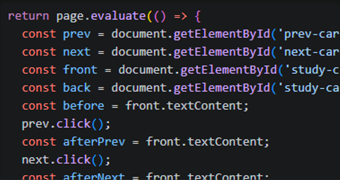

# Flashcards Study App

A simple, accessible flashcards study app built with semantic HTML, CSS, and plain JavaScript. It supports creating and managing decks, adding and editing cards, studying cards in a flip-style interface, searching cards, and saving progress in local storage.

## Features

- Create, edit, and delete decks
- Add, edit, and delete cards
- Study cards with Previous, Flip, and Next controls
- Search cards within the active deck
- Save decks and cards in Local Storage
- Accessible dialogs, keyboard support, and clear empty states

## Project Structure

- index.html — app shell and modal forms
- styles.css — responsive layout and styling
- app.js — app behavior and study interactions
- storage.js — local storage helpers

## Reflection

1. Where AI saved time.
- AI saved time by helping scaffold the app structure, wire up modal behavior, and speed up repetitive DOM and event-listener code.

2. At least one AI bug you identified and how you fixed it.
- One AI-generated bug I identified was the study card navigation failing on first load because the study order was not initialized before rendering. I fixed it by initializing the study state safely before rendering the active card.

3. A code snippet you refactored for clarity.
- I refactored a small block of repeated form-handling logic into clearer helper functions for validation and error messaging, which made the code easier to read and maintain.

4. One accessibility improvement you added.
- One accessibility improvement I added was making the modals and form feedback more accessible with proper ARIA attributes, focus handling, and visible validation messages.

5. What prompt changes improved AI output.
- Prompt changes that improved AI output included being more specific about the expected behavior, accessibility requirements, and edge cases such as empty states, keyboard navigation, and persistence.
